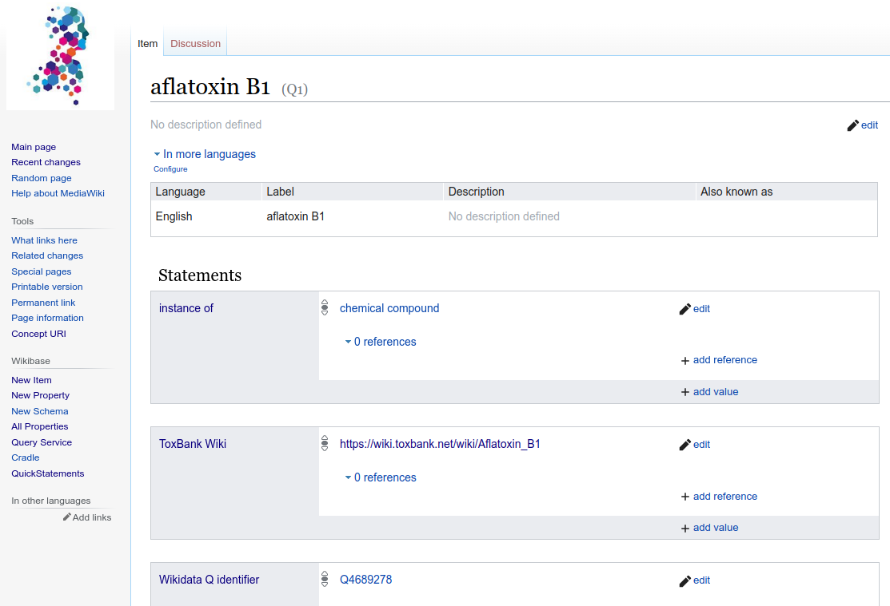

Information about chemicals
===========================

This tutorial explains how to use a few of the VHP4Safety services to aggregate information
about a chemical of interest.

Let's start with the compound with the name "aflatoxin B1".

Name to Structure
-----------------

The first task we have is to establish a chemical identity of what we mean with
"aflatoxin B1". That is, what is the chemical structure. This common task is the
starting point of most cheminformatics workflows: the resolve the chemical
structure from a chemical name. That is, a name to structure conversion.

There are many solutions available, including the main chemical compounds databases
like PubChem and ChemSpider. Because we want to use a common VHP4Safety language (a controlled vocabulary or
glossary), we can also use a VHP4Safety solution for this task.

For this, we have set up a service to link specific chemical structures to
names and external databases, the VHP4Safety Wikibase.

Step 1

Visit https://compoundcloud.wikibase.cloud/ and use the search box to find
"aflatoxin B1". The `resulting page <https://compoundcloud.wikibase.cloud/wiki/Item:Q1>` should look something like this:

On this page we can find chemical information and links to other database.
Information we can find include:

* the SMILES: a line notation to describe the chemical structure (using a chemical graph approach)
* the mass
* the InChI and InChIKey: the global, unique identifier of this compound

Second, we find external identifiers and links to resources with more information
about this compound. For example, for this compound we find a link to the
ToxBank Wiki [`paper` <https://doi.org/10.1002/minf.201200114>] where the SEURAT-1 cluster projects collected information
about compounds in their discussion to reach their Gold Compound collection.

Other information we can find:

* the Wikidata Q identifier: a link to Wikidata
* the PubChem CID: a link to PubChem
* xenobiotic metabolism pathway: a link to a WikiPathways describing experimental knowledge about the compound metabolism

Visualize a Structure
---------------------

... CDK Depict

External databases
------------------

... back in the Wikibase

Metabolite prediction
---------------------

... SOMBIE

