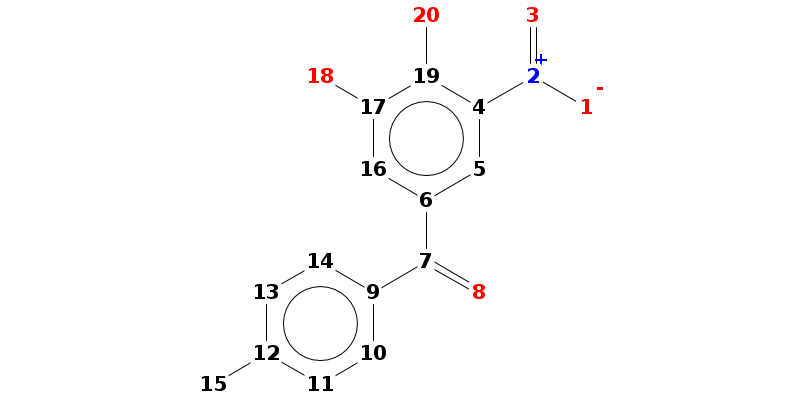

Site-of-Metabolism Prediction
=============================

This page presents a tutorial for `SOM
Prediction <https://cloud.vhp4safety.nl/service/sombie.html>`__. The
tutorial uses Python language and the tutorial is still under
development. The Jupyter Notebook file for this tutorial can be found
`here <https://github.com/VHP4Safety/vhp4safety-docs/blob/main/Tutorials/sombie/site_of_metabolism_prediction.ipynb>`__.

.. code:: ipython3

    # Importing the required modules
    import os 
    import requests
    import pandas
    import base64
    
    from IPython.display import Image, HTML
    
    # Describing the service URL to make the request
    SERVICE_BASE_URL = "https://sombie.cloud.vhp4safety.nl/"

Performing SMARTCyp predictions
~~~~~~~~~~~~~~~~~~~~~~~~~~~~~~~

Integration is based on the
`MDStudio <https://github.com/MD-Studio/MDStudio>`__ wrapper around
SMARTCyp, which provides a convenient endpoint to the
`SMARTCyp <https://smartcyp.sund.ku.dk/about>`__
software\ `ref <https://pubs.acs.org/doi/abs/10.1021/ml100016x>`__\ ,
supporting all of the configuration options, ligand input formats and
result formats.

.. code:: ipython3

    # Requesting information on the installed SMARTCyp version
    response = requests.get('{0}/smartcyp_info'.format(SERVICE_BASE_URL))
    response.json()

.. parsed-literal::

    {'citation': 'Rydberg P., Gloriam D.E., Zaretzki J., Breneman C., Olsen L. SMARTCyp:A 2D Method for Prediction of Cytochrome P450-Mediated Drug Metabolism.ACS Med Chem Lett. 2010;1(3):96-100. Published 2010 Mar 15.',
     'models': ['CYP3A4', 'CYP2C9', 'CYP2D6'],
     'version': '2.4.2'}

Run SMARTCyp starting from a SMILES string
~~~~~~~~~~~~~~~~~~~~~~~~~~~~~~~~~~~~~~~~~~

A SMILES string is the default ligand representation accepted as input
for SMARTCyp. In addition SMARTCyp accepts 2D and 3D structure formats
using the ‘mol’ parameter (see below). Returned results are always
wrapped as a JSON object containing the prediction results as either
JSON (default), CSV or HTML format. In addition you can request the 1D
images (normally displayed as part of the HTML output of SMARTCyp) to be
included in the results (output_png = True). They will be base64 encoded
and thus will require decoding first (shown below). In the example below
the prediction results are loaded into a Pandas DataFrame ready for
analysis and friendly visualization.

.. code:: ipython3

    data = {'smiles': '[O-][N+](=O)c2cc(C(=O)c1ccc(cc1)C)cc(O)c2O', 'output_png': True}
    
    response = requests.post('{0}/smartcyp'.format(SERVICE_BASE_URL), data=data)
    
    response_json = response.json()
    response_df = pandas.DataFrame.from_dict(response_json['result'])
    
    img = response_json['images']['molecule_1_atomNumbers']
    display(Image(base64.decodebytes(img.encode()), width=500))
    
    response_df

.. raw:: html

    

    
    <table border="1" class="dataframe">
      <thead>
        <tr style="text-align: right;">
          <th></th>
          <th>C.10</th>
          <th>C.11</th>
          <th>C.12</th>
          <th>C.13</th>
          <th>C.14</th>
          <th>C.15</th>
          <th>C.16</th>
          <th>C.17</th>
          <th>C.19</th>
          <th>C.4</th>
          <th>C.5</th>
          <th>C.6</th>
          <th>C.7</th>
          <th>C.9</th>
          <th>N.2</th>
          <th>O.1</th>
          <th>O.18</th>
          <th>O.20</th>
          <th>O.3</th>
          <th>O.8</th>
        </tr>
      </thead>
      <tbody>
        <tr>
          <th>2Cranking</th>
          <td>5.0</td>
          <td>4.0</td>
          <td>6.0</td>
          <td>4.0</td>
          <td>5.0</td>
          <td>1.0</td>
          <td>3.0</td>
          <td>9.0</td>
          <td>7.0</td>
          <td>10.0</td>
          <td>2.0</td>
          <td>13.0</td>
          <td>12.0</td>
          <td>11.0</td>
          <td>8.0</td>
          <td>None</td>
          <td>None</td>
          <td>None</td>
          <td>None</td>
          <td>None</td>
        </tr>
        <tr>
          <th>2Cscore</th>
          <td>97.47</td>
          <td>96.92</td>
          <td>1004.66</td>
          <td>96.92</td>
          <td>97.47</td>
          <td>63.82</td>
          <td>94.02</td>
          <td>1010.6</td>
          <td>1004.69</td>
          <td>1010.64</td>
          <td>91.07</td>
          <td>1022.52</td>
          <td>1022.52</td>
          <td>1022.47</td>
          <td>1004.8</td>
          <td>997.28</td>
          <td>1003.15</td>
          <td>997.35</td>
          <td>997.31</td>
          <td>1021.37</td>
        </tr>
        <tr>
          <th>2D6ranking</th>
          <td>5.0</td>
          <td>4.0</td>
          <td>6.0</td>
          <td>4.0</td>
          <td>5.0</td>
          <td>1.0</td>
          <td>3.0</td>
          <td>9.0</td>
          <td>7.0</td>
          <td>10.0</td>
          <td>2.0</td>
          <td>13.0</td>
          <td>12.0</td>
          <td>11.0</td>
          <td>8.0</td>
          <td>None</td>
          <td>None</td>
          <td>None</td>
          <td>None</td>
          <td>None</td>
        </tr>
        <tr>
          <th>2D6score</th>
          <td>99.87</td>
          <td>98.52</td>
          <td>1005.46</td>
          <td>98.52</td>
          <td>99.87</td>
          <td>63.82</td>
          <td>96.42</td>
          <td>1012.2</td>
          <td>1005.49</td>
          <td>1012.24</td>
          <td>93.47</td>
          <td>1025.72</td>
          <td>1025.72</td>
          <td>1025.67</td>
          <td>1005.6</td>
          <td>997.28</td>
          <td>1003.95</td>
          <td>997.35</td>
          <td>997.31</td>
          <td>1024.57</td>
        </tr>
        <tr>
          <th>2DSASA</th>
          <td>25.87</td>
          <td>29.38</td>
          <td>5.97</td>
          <td>29.38</td>
          <td>25.87</td>
          <td>64.6</td>
          <td>22.07</td>
          <td>4.98</td>
          <td>5.22</td>
          <td>4.05</td>
          <td>18.21</td>
          <td>3.11</td>
          <td>3.37</td>
          <td>4.36</td>
          <td>2.55</td>
          <td>43.01</td>
          <td>43.66</td>
          <td>41.14</td>
          <td>42.17</td>
          <td>31.8</td>
        </tr>
        <tr>
          <th>Atom</th>
          <td>C.10</td>
          <td>C.11</td>
          <td>C.12</td>
          <td>C.13</td>
          <td>C.14</td>
          <td>C.15</td>
          <td>C.16</td>
          <td>C.17</td>
          <td>C.19</td>
          <td>C.4</td>
          <td>C.5</td>
          <td>C.6</td>
          <td>C.7</td>
          <td>C.9</td>
          <td>N.2</td>
          <td>O.1</td>
          <td>O.18</td>
          <td>O.20</td>
          <td>O.3</td>
          <td>O.8</td>
        </tr>
        <tr>
          <th>Atom_id</th>
          <td>10</td>
          <td>11</td>
          <td>12</td>
          <td>13</td>
          <td>14</td>
          <td>15</td>
          <td>16</td>
          <td>17</td>
          <td>19</td>
          <td>4</td>
          <td>5</td>
          <td>6</td>
          <td>7</td>
          <td>9</td>
          <td>2</td>
          <td>1</td>
          <td>18</td>
          <td>20</td>
          <td>3</td>
          <td>8</td>
        </tr>
        <tr>
          <th>COODist</th>
          <td>0</td>
          <td>0</td>
          <td>0</td>
          <td>0</td>
          <td>0</td>
          <td>0</td>
          <td>0</td>
          <td>0</td>
          <td>0</td>
          <td>0</td>
          <td>0</td>
          <td>0</td>
          <td>0</td>
          <td>0</td>
          <td>0</td>
          <td>0</td>
          <td>0</td>
          <td>0</td>
          <td>0</td>
          <td>0</td>
        </tr>
        <tr>
          <th>Energy</th>
          <td>80.8</td>
          <td>86.3</td>
          <td>999.0</td>
          <td>86.3</td>
          <td>80.8</td>
          <td>66.4</td>
          <td>77.2</td>
          <td>999.0</td>
          <td>999.0</td>
          <td>999.0</td>
          <td>74.1</td>
          <td>999.0</td>
          <td>999.0</td>
          <td>999.0</td>
          <td>999.0</td>
          <td>999.0</td>
          <td>999.0</td>
          <td>999.0</td>
          <td>999.0</td>
          <td>999.0</td>
        </tr>
        <tr>
          <th>Molecule</th>
          <td>1</td>
          <td>1</td>
          <td>1</td>
          <td>1</td>
          <td>1</td>
          <td>1</td>
          <td>1</td>
          <td>1</td>
          <td>1</td>
          <td>1</td>
          <td>1</td>
          <td>1</td>
          <td>1</td>
          <td>1</td>
          <td>1</td>
          <td>1</td>
          <td>1</td>
          <td>1</td>
          <td>1</td>
          <td>1</td>
        </tr>
        <tr>
          <th>N+Dist</th>
          <td>0</td>
          <td>0</td>
          <td>0</td>
          <td>0</td>
          <td>0</td>
          <td>0</td>
          <td>0</td>
          <td>0</td>
          <td>0</td>
          <td>0</td>
          <td>0</td>
          <td>0</td>
          <td>0</td>
          <td>0</td>
          <td>0</td>
          <td>0</td>
          <td>0</td>
          <td>0</td>
          <td>0</td>
          <td>0</td>
        </tr>
        <tr>
          <th>Ranking</th>
          <td>4.0</td>
          <td>5.0</td>
          <td>6.0</td>
          <td>5.0</td>
          <td>4.0</td>
          <td>1.0</td>
          <td>3.0</td>
          <td>9.0</td>
          <td>7.0</td>
          <td>10.0</td>
          <td>2.0</td>
          <td>12.0</td>
          <td>13.0</td>
          <td>11.0</td>
          <td>8.0</td>
          <td>None</td>
          <td>None</td>
          <td>None</td>
          <td>None</td>
          <td>None</td>
        </tr>
        <tr>
          <th>Relative Span</th>
          <td>0.7</td>
          <td>0.8</td>
          <td>0.9</td>
          <td>0.8</td>
          <td>0.7</td>
          <td>1.0</td>
          <td>0.7</td>
          <td>0.8</td>
          <td>0.9</td>
          <td>0.8</td>
          <td>0.7</td>
          <td>0.6</td>
          <td>0.5</td>
          <td>0.6</td>
          <td>0.9</td>
          <td>1.0</td>
          <td>0.9</td>
          <td>1.0</td>
          <td>1.0</td>
          <td>0.6</td>
        </tr>
        <tr>
          <th>Score</th>
          <td>74.17</td>
          <td>78.72</td>
          <td>991.56</td>
          <td>78.72</td>
          <td>74.17</td>
          <td>55.82</td>
          <td>70.72</td>
          <td>992.4</td>
          <td>991.59</td>
          <td>992.44</td>
          <td>67.77</td>
          <td>994.08</td>
          <td>994.87</td>
          <td>994.03</td>
          <td>991.7</td>
          <td>989.28</td>
          <td>990.05</td>
          <td>989.35</td>
          <td>989.31</td>
          <td>992.93</td>
        </tr>
        <tr>
          <th>Span2End</th>
          <td>3</td>
          <td>2</td>
          <td>1</td>
          <td>2</td>
          <td>3</td>
          <td>0</td>
          <td>3</td>
          <td>2</td>
          <td>1</td>
          <td>2</td>
          <td>3</td>
          <td>4</td>
          <td>5</td>
          <td>4</td>
          <td>1</td>
          <td>0</td>
          <td>1</td>
          <td>0</td>
          <td>0</td>
          <td>4</td>
        </tr>
      </tbody>
    </table>
    

